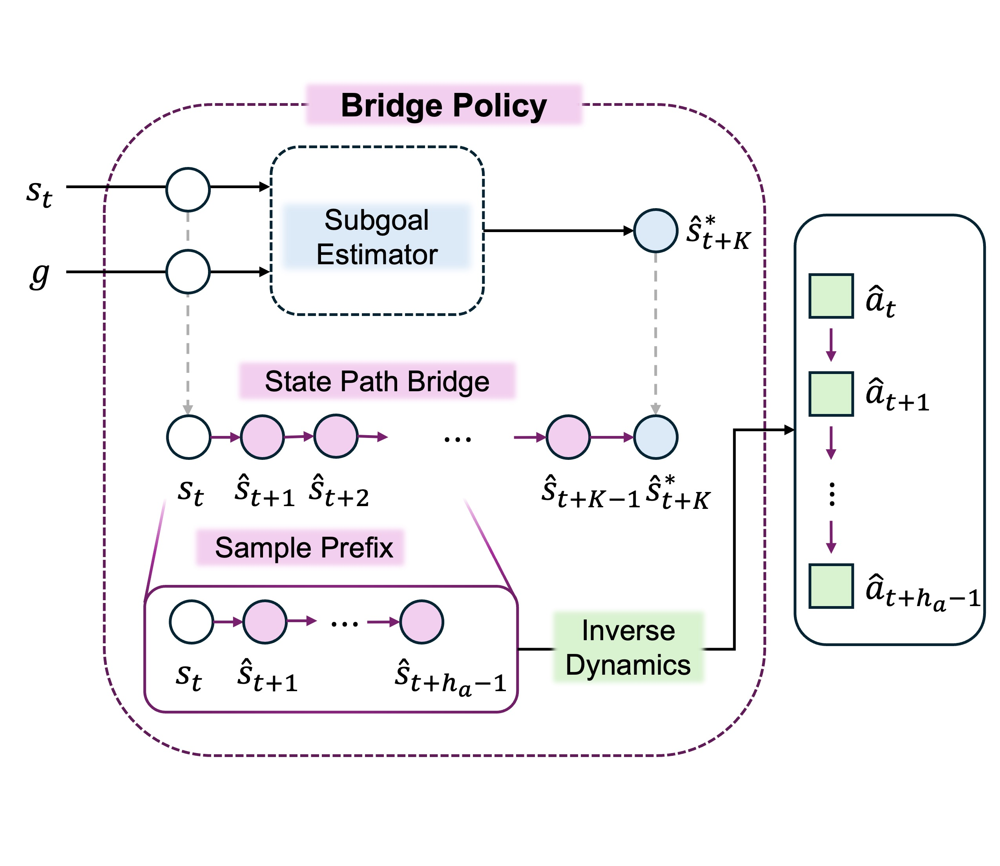

# PathBridger

This repository contains the actor-free reference implementation of
**PathBridger: Subgoal Bridges for Offline Goal-Conditioned Reinforcement
Learning** for state-based OGBench tasks.

**Research team:** [Soohyun Choi](https://github.com/SChoish),
[Seonvin Cho](https://github.com/seonvin0319), and Prof. Songnam Hong.

PathBridger learns exactly four components:

1. a bounded transitive state-goal value and its EMA target,
2. a value-weighted $K$-step endpoint proposer,
3. an endpoint-pinned residual state-space bridge, and
4. an inverse-dynamics model (IDM) that decodes the first five bridge
   transitions into actions.

Both paper variants are included:

- **PBF** uses a conditional rectified flow for endpoint displacements.
- **PBG** uses a conditional diagonal Gaussian.

This release implements the deterministic paper setting only. It does not
include the research-only path-weighting or stochastic-bridge extensions. There
is no neural actor, action-conditioned critic, actor fine-tuning stage, or
legacy algorithm switch.

## Architecture



The diagram is the method overview bundled with the PathBridger paper source.

## Layout

```text
PathBridger/
├── agents/
│   └── pathbridger.py       # Complete algorithm and its fixed constants.
├── assets/
│   └── architecture.jpg     # Paper's bridge-policy overview.
├── configs/
│   ├── pbf/                 # Eight PBF paper configurations.
│   └── pbg/                 # Eight PBG paper configurations.
├── envs/
│   └── env_utils.py         # State-based compact OGBench loading.
├── utils/
│   ├── datasets.py          # Path, endpoint, and transitive-value batches.
│   ├── evaluation.py        # Five-task OGBench environment evaluation.
│   ├── flax_utils.py        # Unified checkpoints and training state.
│   ├── goal_representation.py
│   ├── log_utils.py
│   └── networks.py
├── main.py                  # Offline training.
└── evaluate.py              # Standalone checkpoint evaluation.
```

The root entry points only assemble experiments. The complete PathBridger
objective and inference path live in `agents/pathbridger.py`.

## Installation

Python 3.10 or newer is required.

```bash
git clone https://github.com/SChoish/PathBridger.git
cd PathBridger
python -m venv .venv
source .venv/bin/activate
pip install -e .
```

Install the JAX build appropriate for the host accelerator before training.
Weights & Biases is optional:

```bash
pip install -e ".[tracking]"
```

## Training

The default command trains the paper PBF configuration for
`antmaze-medium-navigate-v0`:

```bash
python main.py --seed=0
```

The editable install also provides the equivalent `pathbridger-train` and
`pathbridger-eval` commands.

Select any paper configuration with `--agent`:

```bash
python main.py \
  --agent=configs/pbf/cube_double.py \
  --seed=0 \
  --run_group=paper
```

Training uses one million gradient steps, a batch size of 1024, and saves every
100k steps by default. The checkpoints used by the paper protocol—800k, 900k,
and 1M—are therefore always available.

Host batch sampling is prefetched on one worker by default and can be disabled
with `--noasync_prefetch`. Checkpoint boundaries preserve the exact sampler RNG
state used for deterministic resume.

An explicit directory containing compact OGBench train/validation shards can be
passed with `--dataset_dir`. Run `python main.py --helpfull` for runtime and
logging flags.

Outputs use one unified checkpoint:

```text
exp/pathbridger/<run_group>/<experiment>/
├── flags.json
├── train.csv
├── eval.csv
└── checkpoints/
    ├── params_800000.pkl
    ├── params_900000.pkl
    └── params_1000000.pkl
```

A unified checkpoint includes the agent, optimizer, JAX key, and host sampler
RNG states, so interrupted offline training can resume without resetting its
batch stream.

## Evaluation

Training and standalone evaluation both use the standard five predefined
OGBench tasks. Each episode runs to the environment's advertised maximum
length, actions are clipped to the environment bounds, and success is the
any-step aggregation of `info["success"]`.

```bash
python evaluate.py \
  --agent=configs/pbf/cube_double.py \
  --checkpoint_dir=exp/pathbridger/paper/<run>/checkpoints \
  --checkpoint_step=1000000 \
  --episodes=50
```

For an exact `params_<step>.pkl` path, the step is inferred from the filename;
for a checkpoint directory, pass `--checkpoint_step`.

The configuration supplies the paper's endpoint candidate count $N$ and
sampling temperature $T$.

## Paper configurations

The following values are transcribed from the environment-specific settings
table in the paper supplementary material. $c_{\mathrm{sg}}$ is the endpoint
value-weight scale and $\lambda$ is the value distance-weight exponent. $N$ and
$T$ are the Best-of-$N$ candidate count and sampling temperature.

### PBF

| Config | Environment | $K$ | $\gamma$ | $c_{\mathrm{sg}}$ | $\lambda$ | $N$ | $T$ |
|---|---|---:|---:|---:|---:|---:|---:|
| `pbf/antmaze_medium.py` | antmaze-medium-navigate-v0 | 25 | 0.99 | 10 | 0.0 | 8 | 0.25 |
| `pbf/antmaze_large.py` | antmaze-large-navigate-v0 | 25 | 0.995 | 10 | 0.0 | 32 | 0.5 |
| `pbf/cube_single.py` | cube-single-play-v0 | 40 | 0.99 | 5 | 0.7 | 1 | 0 |
| `pbf/cube_double.py` | cube-double-play-v0 | 40 | 0.99 | 10 | 1.0 | 8 | 0.25 |
| `pbf/cube_triple.py` | cube-triple-play-v0 | 40 | 0.995 | 10 | 1.0 | 1 | 0 |
| `pbf/puzzle_3x3.py` | puzzle-3x3-play-v0 | 25 | 0.99 | 10 | 0.5 | 32 | 1.0 |
| `pbf/puzzle_4x4.py` | puzzle-4x4-play-v0 | 25 | 0.99 | 10 | 2.0 | 16 | 1.0 |
| `pbf/scene.py` | scene-play-v0 | 25 | 0.99 | 5 | 1.0 | 8 | 0.5 |

### PBG

| Config | Environment | $K$ | $\gamma$ | $c_{\mathrm{sg}}$ | $\lambda$ | $N$ | $T$ |
|---|---|---:|---:|---:|---:|---:|---:|
| `pbg/antmaze_medium.py` | antmaze-medium-navigate-v0 | 25 | 0.99 | 10 | 0.0 | 1 | 0 |
| `pbg/antmaze_large.py` | antmaze-large-navigate-v0 | 25 | 0.995 | 10 | 0.0 | 1 | 0 |
| `pbg/cube_single.py` | cube-single-play-v0 | 25 | 0.99 | 10 | 0.7 | 1 | 0 |
| `pbg/cube_double.py` | cube-double-play-v0 | 25 | 0.99 | 10 | 1.0 | 1 | 0 |
| `pbg/cube_triple.py` | cube-triple-play-v0 | 25 | 0.995 | 10 | 1.0 | 1 | 0 |
| `pbg/puzzle_3x3.py` | puzzle-3x3-play-v0 | 40 | 0.99 | 10 | 0.5 | 2 | 0.25 |
| `pbg/puzzle_4x4.py` | puzzle-4x4-play-v0 | 40 | 0.995 | 10 | 2.0 | 32 | 0.5 |
| `pbg/scene.py` | scene-play-v0 | 40 | 0.99 | 5 | 1.0 | 16 | 0.5 |

## Goal-sampling mixes

Goal probabilities use the paper's four-tuple order
`(p_cur, p_geom, p_traj, p_rand)`. There is no separate geometric-sampling
boolean.

- `dynamics_p=(0, 0, 1, 0)` samples ordinary trajectory-future goals for the
  endpoint/subgoal dynamics branch (the paper table labels this mix “Subgoal”).
- `critic_p=(0, 1, 0, 0)` samples geometric future goals for the scalar
  transitive value.

`p_geom` and `p_traj` are mutually exclusive future-goal implementations.
Because the final transitive value loss requires an ordered in-trajectory pair,
`critic_p` must place all probability on either `p_geom` or `p_traj`.

## Fixed implementation choices

The following are code constants rather than configuration options:

- three 512-unit GELU layers with layer normalization,
- Adam with learning rate $3\times10^{-4}$,
- value expectile 0.7 and EMA rate 0.005,
- base and action horizons of 5,
- endpoint-weight cap 5,
- eight Euler steps for PBF,
- unit coefficients for the value, endpoint, bridge, and IDM losses.

Bridge interpolation, endpoint mask, and product endpoint score:

$$
\alpha_i=(i/K)^{0.8},\qquad
m_i=\frac{i(K-i)}{K^2},\qquad
V(s,z)\,V(z,g).
$$

Distance weighting uses the target value without an undocumented clip and is
applied to both base and transitive value losses.

The dataset sampler transfers only the five supervised bridge-prefix targets
with each batch (`[B, 5, D]`), rather than the full path (`[B, K+1, D]`). During
inference, the model likewise constructs only the six states consumed by the
five-step IDM policy.

To reproduce the reported experiments, training keeps the paper sampler's
close-goal behavior: when a sampled final goal occurs before $t+K$, the endpoint
is clipped to that goal and the five supervised bridge-prefix targets are
padded with the goal state.
